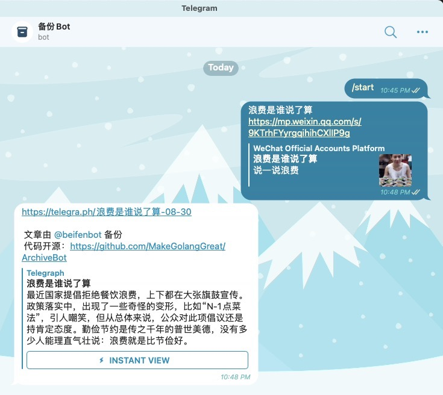

# 备份 Bot

> 一个用来备份链接内容的 Telegram Bot

发给 Bot 一个链接/包含链接的文本，它将检测其中的链接，并启动爬虫程序将链接中的信息抓下来然后上传到 Telegraph 平台上，最后给你一个可在线访问的 Telegraph（Telegram 出品）链接。


### 预览

---



### 如何本地运行？

---

**准备工作：**

1. 你需要在本地配置好`Golang`的环境
2. 下载好项目代码
3. 你需要在项目根目录创建一个`config.json`文件，并且输入下面几个信息：

```json
{
    "botToken": "111111111:xxxxxxxxxxxxxxxxxxxxxxxxxxxxxxxxxx", // Telegraph Bot Token 请找 @BotFather 获取 https://t.me/@BotFather
    "telegraphToken": "b968da509bb76866c35425099bc0989a5ec3b32997d55286c657e6994bbb", // Telegraph Token，可以用这个测试 Token ，也可以自行注册一个Telegraph Account 然后会得到一个 Token，请阅读 https://telegra.ph/api#createAccount
    "socks5": "socks5://localhost:1085" // 如果你在国内等无法直连 Telegraph 的环境中，那么就需要配置下，让程序走代理（端口不一定是1085，看你电脑代理软件配置的是啥）。如果你不明白这里在说什么，请先上网找翻墙教程，把墙翻了再说。
}
```


**运行程序：**

在项目根目录下执行`go run *.go`，看到命令行输出`Authorized on account ...`这样的信息就说明项目跑起来了。

然后去 Telegram，找到你创建的那个测试Bot，试着发一段文本给它，同时留意命令行的输出。


有问题请反馈到 [issues区](https://github.com/MakeGolangGreat/ArchiveBot/issues)
